# Interactive Map Implementation

A comprehensive interactive map system built with Google Maps API, featuring category-based filtering, marker clustering, and responsive design. This implementation supports multi-language content and dynamic zoom calculation based on geographic marker distribution.

## Environments
- Preview: https://main--map-demo--meejain.aem.page/
- Live: https://main--map-demo--meejain.aem.live/

## 🎯 **Generic Demo Implementation**

**⚠️ IMPORTANT**: This codebase contains **generic placeholder content** designed to be customized for your specific project:

- **All project data** uses Lorem Ipsum placeholder text
- **All images** reference generic "adobe-logo" placeholders  
- **All URLs** redirect to the homepage (`/`) with TODO comments for customization
- **Partner names** use generic "Lorem Ipsum Organization"
- **Project titles** use generic Lorem Ipsum content

### 🔄 Quick Customization Checklist
- [ ] Replace `"adobe-logo"` with your actual image names in `createInfoBoxContent()` calls
- [ ] Update `localizedUrl = '/'` with your project-specific URLs
- [ ] Replace lorem ipsum titles with your actual project titles
- [ ] Update partner names from "Lorem Ipsum Organization" to real organizations
- [ ] Customize image source domain from `main--map-demo--meejain.aem.page` to your domain
- [ ] Uncomment and customize `getLocalizedUrl()` function if you need localized URLs

## 🗺️ Quick Overview

Interactive map system with:
- **Category-based filtering** with auto-zoom
- **Marker clustering** for performance  
- **Custom InfoBox popups** with rich content
- **Multi-language support** (English/French)
- **Responsive design** for mobile/desktop

### 📁 Key Files
```
blocks/map/
├── map.js              # Main decorator & setup
├── initmapscript.js    # Map initialization & markers  
├── mapstyles.js        # Visual styling
├── map.css            # CSS styles
├── markerclusterer.js  # Performance clustering
└── infobox.js         # Custom popups
```

### 🔄 System Flow

```mermaid
flowchart LR
    A["`**Page Load**
    HTML Block`"] --> B["`**map.js**
    Decorator`"]
    
    B --> C["`**Setup**
    Container + Nonce`"]
    
    C --> D["`**Dependency Loading**`"]
    
    D --> F["`**initmapscript.js**
    +initMap() function`"]
    D --> G["`**mapstyles.js**
    +Visual config`"]
    D --> H["`**markerclusterer.js**
    +Clustering lib`"]
    
    F --> I["`**Google Maps API**
    callback=initMap`"]
    G --> I
    H --> I
    
    I --> J["`**initMap()**
    Execution`"]
    
    J --> K1["`**Map Creation**
    new google.maps.Map()`"]
    J --> K2["`**Load infobox.js**
    Custom popups`"]
    J --> K3["`**Create Markers**
    Coordinates + Categories`"]
    
    K1 --> L["`**Apply Styling**
    audemarsmapstyles`"]
    K2 --> M["`**InfoBox Setup**
    Rich popup content`"]
    K3 --> N["`**Marker Clustering**
    Performance optimization`"]
    
    L --> O["`**Category Integration**`"]
    M --> O
    N --> O
    
    O --> P["`**filterMapByCategory()**
    Dynamic zoom logic`"]
    
    P --> Q["`**🗺️ Interactive Map**
    ✓ Clickable markers
    ✓ Category filtering  
    ✓ Auto-zoom
    ✓ Custom popups
    ✓ Multi-language`"]

    style A fill:#e3f2fd
    style B fill:#f3e5f5
    style I fill:#fce4ec
    style J fill:#e8f5e8
    style Q fill:#e1f5fe
    style D fill:#fff3e0
    style O fill:#f1f8e9
```


## 🏷️ Category Filtering

The map supports category-based filtering with automatic zoom adjustment. Each marker has a `category` property that connects to filter buttons.

**To customize categories**, edit `/blocks/cards/cards.js`:
```javascript
const categoryMapping = {
  'All items': { categoryId: 'all', isActive: true },
  'option1': { categoryId: 'category_3' },
  'option2': { categoryId: 'category_4' },
  'option3': { categoryId: 'category_5' },
  'option4': { categoryId: 'category_10' },
};
```

> 📋 **For detailed examples**, see [README-map-categories.md](./README-map-categories.md)

## 🌍 Multi-language Support

**Current Implementation**: All URLs redirect to `/` (homepage)

**Optional**: For localized URLs, uncomment the `getLocalizedUrl()` function in `initmapscript.js` and customize the project mapping.

**Content localization available for**:
- Country names ✅
- Category labels ✅  
- Project titles (currently Lorem Ipsum - customize as needed)
- Partner names (currently generic - customize as needed)

## 🔧 Quick Setup

### 1. Google Maps API Key
Add your API key to `/config.js`:
```javascript
const config = {
  googleMaps: {
    apiKey: 'your-google-maps-api-key',
  },
};
```

Get your API key from [Google Cloud Console](https://console.cloud.google.com/) and enable the Maps JavaScript API.

### 2. Customizing Content

**Replace placeholder content in `initmapscript.js`**:

| Current Generic Value | Customize To |
|---------------------|--------------|
| `"adobe-logo"` | Your actual image filenames |
| `"Lorem Ipsum Organization"` | Real organization names |
| Lorem ipsum titles | Real project titles |
| `https://main--map-demo--meejain.aem.page/` | Your domain |

## 🛠️ Development

### Local Development
```sh
aem up
# Navigate to http://localhost:3000/your-map-page
```

**Note**: No build process or `npm install` required! This project serves static files directly.

**Optional**: Run `npm install` only if you want to use the linting tools during development:
```sh
npm install  # Only for linting tools (optional)
npm run lint # Check code style
```

### Common Tasks
1. **Replace placeholder content** (see "From Demo to Production" below)
2. **Add categories**: Update `categoryMapping` in `cards.js`
3. **Style changes**: Modify `mapstyles.js` and `map.css`
4. **New markers**: Add to `initmapscript.js`

## 🚀 From Demo to Production

This is a **generic demo** with placeholder content. To use in production:

### Quick Migration

1. **Replace placeholder content**:
   ```bash
   # Search and replace in initmapscript.js
   find . -name "initmapscript.js" -exec sed -i 's/adobe-logo/your-image-name/g' {} \;
   find . -name "initmapscript.js" -exec sed -i 's/Lorem Ipsum Organization/Your Organization/g' {} \;
   ```

2. **Update domains**:
   - Change `https://main--map-demo--meejain.aem.page/` to your domain
   - Configure Google Maps API key for your domain

3. **Choose URL routing**:
   - **Simple**: Keep `window.location.href = '/'` (current)
   - **Advanced**: Uncomment `getLocalizedUrl()` function for localized URLs

### Production Checklist
- [ ] Replace all "adobe-logo" with real image names
- [ ] Update Lorem Ipsum content with real project data
- [ ] Configure Google Maps API key for production domain
- [ ] Test category filtering with real data
- [ ] Review all TODO comments in code

---

## 📚 Additional Resources

- [Google Maps JavaScript API](https://developers.google.com/maps/documentation/javascript)
- [README-map-categories.md](./README-map-categories.md) - Category customization guide
- [AEM Edge Delivery Services](https://www.aem.live/docs/)
