# Interactive Map Implementation

A comprehensive interactive map system built with Google Maps API, featuring category-based filtering, marker clustering, and responsive design. This implementation supports multi-language content and dynamic zoom calculation based on geographic marker distribution.

## 🗺️ Map System Overview

This project implements a sophisticated interactive map system located in `/blocks/map/` with the following core capabilities:

- **Interactive Google Maps** with custom styling
- **Category-based filtering** with automatic zoom adjustment
- **Marker clustering** for performance optimization
- **Multi-language support** (English/French)
- **Responsive design** with mobile-friendly controls
- **Custom InfoBox popups** with rich content
- **Dynamic content localization**

## 📁 Map Architecture

### Core Files Structure

```
blocks/map/
├── map.js              # 🎯 Main decorator & dependency loader
├── initmapscript.js    # 🗺️ Map initialization & marker setup
├── mapstyles.js        # 🎨 Google Maps visual styling
├── map.css            # 💅 CSS styles for map & popups
├── markerclusterer.js  # 📍 Marker clustering functionality
└── infobox.js         # 💬 Custom InfoWindow implementation
```

### Supporting Files

```
blocks/cards/cards.js   # 🏷️ Category filtering integration
config.js              # ⚙️ API keys & configuration
scripts/dom-helpers.js  # 🔧 DOM utilities
scripts/utils.js       # 🛠️ Utility functions
```

## 🔄 System Flow Diagram

The following diagram shows how all components work together:

```mermaid
flowchart TD
    A["`**Page Load**
    HTML contains map block`"] --> B["`**map.js**
    Block decorator function`"]
    
    B --> C["`**Setup Phase**
    - Create map container div
    - Generate security nonce
    - Get locale from URL`"]
    
    C --> D["`**loadMapScripts()**
    Sequential dependency loading`"]
    
    D --> E["`**jQuery**
    Load from CDN
    Required by initmapscript.js`"]
    
    E --> F["`**initmapscript.js**
    Defines initMap() function
    + Language detection
    + Project URL mapping`"]
    
    F --> G["`**mapstyles.js**
    Map visual styling config
    (audemarsmapstyles variable)`"]
    
    G --> H["`**markerclusterer.js**
    Marker clustering library
    Groups nearby markers`"]
    
    H --> I["`**Google Maps API**
    Load with callback=initMap
    + API key from config.js
    + Locale parameter`"]
    
    I --> J["`**initMap() Execution**
    Core map initialization`"]
    
    J --> K["`**Map Creation**
    new google.maps.Map()
    + Custom styles applied
    + Center & zoom settings`"]
    
    K --> L["`**Load infobox.js**
    Custom InfoWindow library
    For styled popups`"]
    
    L --> M["`**Create Markers**
    For each project:
    - Lat/lng coordinates
    - Category assignment
    - InfoBox content`"]
    
    M --> N["`**Marker Clustering**
    MarkerClusterer groups markers
    + Custom cluster styles
    + Performance optimization`"]
    
    N --> O["`**Category Filter Setup**
    cards.js integration:
    - filterMapByCategory()
    - Dynamic bounds calculation`"]
    
    O --> P["`**Interactive Map Ready**
    - Clickable markers
    - Category filtering
    - Auto-zoom on filter
    - Custom popups
    - Responsive design`"]

    style A fill:#e1f5fe
    style J fill:#f3e5f5
    style P fill:#e8f5e8
    style B fill:#fff3e0
    style I fill:#fce4ec
```



## 📋 Detailed Component Breakdown

### 🎯 map.js - Main Entry Point
**Purpose**: Block decorator and dependency orchestrator

**Key Functions**:
- `decorate(block)`: Main entry point called by AEM system
- `loadScript(src, attrs)`: Loads external JavaScript files with promises
- `loadMapScripts(nonce)`: Sequentially loads all map dependencies
- `googleMapLoader(nonce, locale)`: Loads Google Maps API with callback
- `generateNonce()`: Creates security nonce for script loading

**Dependency Loading Order**:
1. jQuery (required by legacy code in initmapscript.js)
2. initmapscript.js (defines `initMap()` function)
3. mapstyles.js (styling configuration)
4. markerclusterer.js (clustering functionality)
5. Google Maps API (triggers `initMap()` callback)

### 🗺️ initmapscript.js - Core Map Logic
**Purpose**: Map initialization, marker creation, and business logic

**Key Features**:
- **Map Initialization**: Creates Google Maps instance with custom styling
- **Marker Management**: Defines all project markers with coordinates and metadata
- **Language Detection**: Automatically detects language from URL path
- **URL Localization**: Maps project slugs to localized URLs
- **InfoBox Content**: Generates rich popup content for each marker
- **Category Filtering**: Implements map filtering logic (now shared via `filterMapByCategory()`)

**Data Structure**:
```javascript
// Example marker creation
var marker = new google.maps.Marker({
  position: new google.maps.LatLng(latitude, longitude),
  map: map,
  category: "category_3", // Used for filtering
  item: uniqueId,         // Identifies marker
  icon: customIcon        // Custom marker appearance
});
```

### 🎨 mapstyles.js - Visual Styling
**Purpose**: Defines custom Google Maps appearance

**Features**:
- Custom color scheme (muted tones)
- Hidden administrative labels for cleaner look
- Custom water and landscape colors
- Simplified road and POI visibility
- Maintains focus on project markers

**Usage**:
```javascript
// Applied during map creation
map = new google.maps.Map(document.getElementById('map'), {
  styles: audemarsmapstyles, // Imported from mapstyles.js
  // ... other options
});
```

### 💅 map.css - Visual Styling
**Purpose**: CSS styles for map container and interactive elements

**Key Styles**:
- **Map Container**: Full-height responsive design
- **InfoBox Styling**: Custom popup appearance with arrow pointers
- **Zoom Controls**: Custom positioned zoom buttons
- **Responsive Design**: Mobile-friendly interactions
- **Typography**: Custom font families and sizing

### 📍 markerclusterer.js - Performance Optimization
**Purpose**: Groups nearby markers into clusters for better performance

**Features**:
- **Dynamic Clustering**: Groups markers based on zoom level and proximity
- **Custom Cluster Icons**: Branded cluster appearance
- **Performance Optimization**: Reduces DOM elements for better performance
- **Zoom-based Behavior**: Shows individual markers when zoomed in
- **Click Handling**: Expands clusters when clicked

**Configuration**:
```javascript
markerCluster = new MarkerClusterer(map, markers, {
  imagePath: '/assets/images/',
  styles: [{
    url: 'custom-cluster-icon.png',
    width: 56,
    height: 56,
    textColor: '#ffffff',
    textSize: 12
  }]
});
```

### 💬 infobox.js - Custom Popups
**Purpose**: Extended InfoWindow functionality with custom styling

**Advantages over Standard InfoWindow**:
- **Custom Styling**: Full CSS control over appearance
- **Advanced Positioning**: More flexible positioning options
- **Rich Content Support**: Better HTML content handling
- **Animation Support**: Smooth open/close transitions
- **Event Handling**: Enhanced interaction capabilities

## 🏷️ Category Filtering System

### How Category Filtering Works

The map supports dynamic filtering by categories (option1, option2, option3, option4) with automatic zoom adjustment:

1. **Category Assignment**: Each marker has a `category` property
2. **Filter Trigger**: User clicks category filter in cards block
3. **Marker Filtering**: `filterMapByCategory()` shows/hides markers
4. **Bounds Calculation**: Creates geographic bounds containing visible markers
5. **Auto-zoom**: `map.fitBounds()` automatically adjusts zoom level

### Dynamic Zoom Calculation

The system doesn't use pre-defined zoom levels. Instead:

```javascript
// Create bounds containing all visible markers
window.bounds = new google.maps.LatLngBounds();

// Extend bounds with each visible marker's position
window.markers.forEach((marker) => {
  if (marker matches category) {
    window.bounds.extend(marker.position);
  }
});

// Google Maps automatically calculates optimal zoom
window.map.fitBounds(window.bounds);
```

**Zoom Level Factors**:
- **Geographic spread**: Wider spread = lower zoom (zoomed out)
- **Marker density**: Clustered markers = higher zoom (zoomed in)
- **Viewport size**: Smaller screens may get different zoom levels

### Customizing Categories

To customize categories for your project, modify the mapping in `/blocks/cards/cards.js`:

```javascript
const categoryMapping = {
  'All items': { categoryId: 'all', isActive: true },
  'option1': { categoryId: 'category_3' },
  'option2': { categoryId: 'category_4' },
  'option3': { categoryId: 'category_5' },
  'option4': { categoryId: 'category_10' },
};
```

## 🌍 Multi-language Support

The system supports English and French content:

### Language Detection
```javascript
function getCurrentLanguage() {
  const path = window.location.pathname;
  return path.includes('/fr/') ? 'fr' : 'en';
}
```

### Localized URLs
Project slugs are automatically mapped to localized URLs:
```javascript
// English: /en/fondation-pour-les-arbres-projects/project-slug
// French:  /fr/fondation-pour-les-arbres-nos-projets/projet-francais
```

### Content Localization
- Country names
- Project titles  
- Interface elements
- URL structures

## 🔧 Configuration & Setup

### 1. Installation

```sh
npm install
```

### 2. Configuration

The system uses `/config.js` for API keys and settings:

```javascript
const config = {
  googleMaps: {
    apiKey: 'your-google-maps-api-key',
  },
};
```

### 3. Google Maps API Setup

1. **Get API Key**: [Google Cloud Console](https://console.cloud.google.com/)
2. **Enable APIs**: Maps JavaScript API, Geocoding API (if needed)
3. **Restrict Key**: Limit to your domain for security
4. **Set Quotas**: Configure usage limits

### 4. Adding New Markers

To add new markers, edit `/blocks/map/initmapscript.js`:

```javascript
// Create marker
var markerLatLng = new google.maps.LatLng(latitude, longitude);
var marker = new google.maps.Marker({
  position: markerLatLng,
  map: map,
  category: "category_3", // Choose appropriate category
  item: uniqueId,
  icon: iconpointer
});

// Create InfoBox content
var popupContent = createInfoBoxContent(
  imageId, imageName, partner, country, 
  dateRange, title, category, projectSlug
);

// Add to arrays
markers.push(marker);
bounds.extend(markerLatLng);
infoWindows[uniqueId] = new InfoBox(popupOptions);
```

## 📱 Responsive Design

### Mobile Optimizations
- **Touch-friendly controls**: Large tap targets for mobile
- **Responsive popups**: InfoBoxes adapt to screen size
- **Gesture support**: Pinch-to-zoom, pan, rotate
- **Performance**: Optimized for mobile devices

### CSS Media Queries
```css
@media (max-width: 768px) {
  #map {
    height: 70vh; /* Adjust height on mobile */
  }
  
  .myboxmap {
    max-width: 90vw; /* Responsive popup width */
  }
}
```

## 🚀 Performance Optimizations

### 1. Script Loading
- **Sequential loading**: Prevents dependency conflicts
- **Async/defer**: Non-blocking script loading
- **CDN usage**: Fast jQuery loading from Google CDN

### 2. Marker Clustering
- **Reduces DOM elements**: Clusters nearby markers
- **Zoom-based visibility**: Shows details when zoomed in
- **Custom cluster styling**: Maintains visual consistency

### 3. Memory Management
- **Event cleanup**: Removes listeners when not needed
- **Efficient bounds calculation**: Only recalculates when filtering
- **Optimized InfoBox usage**: Reuses popup instances

## 🛠️ Development Workflow

### Local Development
```sh
# Start AEM development server
aem up

# Navigate to map page
http://localhost:3000/your-map-page
```

### Adding Features
1. **New marker categories**: Update `categoryMapping` in cards.js
2. **Custom styling**: Modify `audemarsmapstyles` in mapstyles.js
3. **New marker fields**: Extend `createInfoBoxContent()` function
4. **UI improvements**: Update map.css

### Debugging Tips
- **Browser DevTools**: Check console for API errors
- **Network tab**: Verify all scripts load successfully
- **Google Maps Console**: Monitor API usage and errors
- **Category filtering**: Test with different zoom levels

## 📊 Analytics & Monitoring

### Recommended Tracking
- **Map interactions**: Marker clicks, category filters
- **Performance metrics**: Load times, clustering effectiveness  
- **User behavior**: Zoom patterns, popular markers
- **API usage**: Quota monitoring, error rates

### Implementation Example
```javascript
// Track marker clicks
marker.addListener('click', function() {
  // Analytics code
  gtag('event', 'marker_click', {
    'custom_parameter': this.category
  });
  
  // Existing click handler
  window.location.href = getLocalizedUrl(projectSlug);
});
```

## 🔒 Security Considerations

### API Key Security
- **Domain restrictions**: Limit API key to your domains
- **Quota limits**: Set reasonable usage limits
- **Regular rotation**: Change API keys periodically

### Content Security Policy
```javascript
// Nonce generation for script loading
function generateNonce() {
  return btoa(crypto.getRandomValues(new Uint8Array(16)).join(''));
}
```

## 📚 Documentation References

- [Google Maps JavaScript API](https://developers.google.com/maps/documentation/javascript)
- [MarkerClusterer Documentation](https://github.com/googlemaps/markerclustererplus)
- [AEM Edge Delivery Services](https://www.aem.live/docs/)
- [Map Category Configuration Guide](./README-map-categories.md)

## 🤝 Contributing

When contributing to the map system:

1. **Test thoroughly**: Verify all categories and zoom levels
2. **Maintain performance**: Monitor clustering and load times
3. **Update documentation**: Keep README and comments current
4. **Follow conventions**: Use established naming patterns
5. **Test multi-language**: Verify both English and French content

## 📈 Future Enhancements

### Planned Features
- **Search functionality**: Find markers by text search
- **Custom marker icons**: Category-specific marker designs
- **Layer support**: Toggle different data layers
- **Export features**: Share/save map states
- **Advanced filtering**: Multiple category selection

### Technical Improvements
- **Modern JavaScript**: Convert to ES6 modules
- **TypeScript support**: Add type definitions
- **Testing framework**: Automated testing for map functionality
- **Bundle optimization**: Reduce initial load size

---

*For detailed configuration options and examples, see [README-map-categories.md](./README-map-categories.md)*